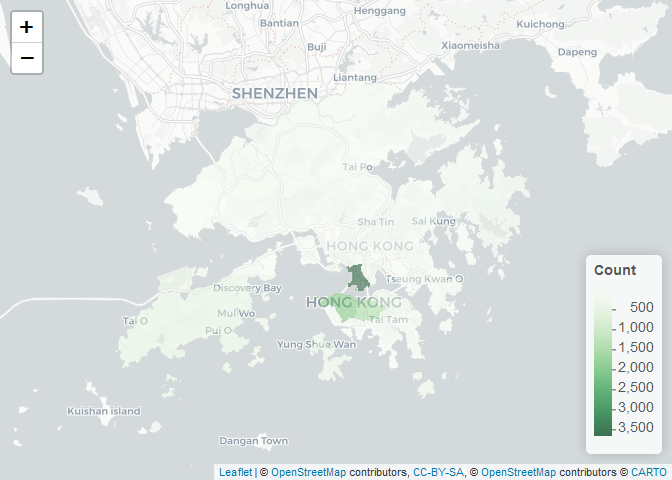
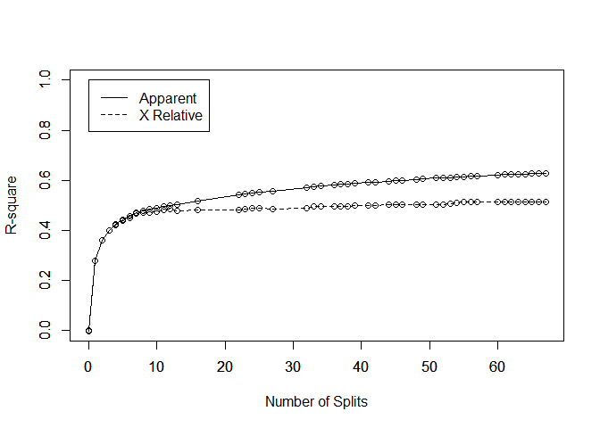

# Data Programming with R Final Project – Predicting Airbnb Price in HongKong using Regression Tree, Random Forest and Boost

*By Zidong Li *

## Part 1. Data Preprocessing

### Read Essential Libraries

``` r
library(ggplot2)
library(readxl)
library(data.table)
library(tidyr)
library(dplyr)
```

    ## 
    ## Attaching package: 'dplyr'

    ## The following objects are masked from 'package:data.table':
    ## 
    ##     between, first, last

    ## The following objects are masked from 'package:stats':
    ## 
    ##     filter, lag

    ## The following objects are masked from 'package:base':
    ## 
    ##     intersect, setdiff, setequal, union

``` r
library(gapminder)
library(fastDummies)
library(rpart)
library(Metrics)
library(caret)
```

    ## Loading required package: lattice

    ## 
    ## Attaching package: 'caret'

    ## The following objects are masked from 'package:Metrics':
    ## 
    ##     precision, recall

``` r
library(randomForest)
```

    ## randomForest 4.6-14

    ## Type rfNews() to see new features/changes/bug fixes.

    ## 
    ## Attaching package: 'randomForest'

    ## The following object is masked from 'package:dplyr':
    ## 
    ##     combine

    ## The following object is masked from 'package:ggplot2':
    ## 
    ##     margin

``` r
library(checkmate)
library(adabag)
```

    ## Loading required package: foreach

    ## Loading required package: doParallel

    ## Loading required package: iterators

    ## Loading required package: parallel

``` r
library(gbm)
```

    ## Loaded gbm 2.1.5

``` r
library(corrplot)
```

    ## corrplot 0.84 loaded

``` r
library(FNN)
library(neuralnet)
```

    ## 
    ## Attaching package: 'neuralnet'

    ## The following object is masked from 'package:dplyr':
    ## 
    ##     compute

``` r
library(nnet)
library(BBmisc)
```

    ## 
    ## Attaching package: 'BBmisc'

    ## The following objects are masked from 'package:dplyr':
    ## 
    ##     coalesce, collapse

    ## The following object is masked from 'package:base':
    ## 
    ##     isFALSE

``` r
library(xgboost)
```

    ## 
    ## Attaching package: 'xgboost'

    ## The following object is masked from 'package:dplyr':
    ## 
    ##     slice

``` r
library(leaps)
library(scorer)
```

    ## 
    ## Attaching package: 'scorer'

    ## The following objects are masked from 'package:Metrics':
    ## 
    ##     ae, ape, mape, rmse

``` r
library(ggmap)
```

    ## Google's Terms of Service: https://cloud.google.com/maps-platform/terms/.

    ## Please cite ggmap if you use it! See citation("ggmap") for details.

``` r
library(osmdata)
```

    ## Data (c) OpenStreetMap contributors, ODbL 1.0. http://www.openstreetmap.org/copyright

``` r
library(leaflet.extras)
```

    ## Loading required package: leaflet

``` r
library(rgdal)
```

    ## Loading required package: sp

    ## rgdal: version: 1.4-6, (SVN revision 841)
    ##  Geospatial Data Abstraction Library extensions to R successfully loaded
    ##  Loaded GDAL runtime: GDAL 2.2.3, released 2017/11/20
    ##  Path to GDAL shared files: C:/Users/lzd05/Documents/R/win-library/3.6/rgdal/gdal
    ##  GDAL binary built with GEOS: TRUE 
    ##  Loaded PROJ.4 runtime: Rel. 4.9.3, 15 August 2016, [PJ_VERSION: 493]
    ##  Path to PROJ.4 shared files: C:/Users/lzd05/Documents/R/win-library/3.6/rgdal/proj
    ##  Linking to sp version: 1.3-1

``` r
library(naniar)
```

### Read Data and Variables

``` r
HongKong = read_excel('Hongkong.xlsx')
```

    ## Warning in read_fun(path = enc2native(normalizePath(path)), sheet_i =
    ## sheet, : Expecting logical in BM8739 / R8739C65: got 'wwhostel'

    ## Warning in read_fun(path = enc2native(normalizePath(path)), sheet_i =
    ## sheet, : Expecting logical in BM10254 / R10254C65: got '18-618219'

``` r
names(HongKong)
```

    ##  [1] "host_since"                                  
    ##  [2] "host_length"                                 
    ##  [3] "host_response_time"                          
    ##  [4] "host_response_rate"                          
    ##  [5] "host_is_superhost"                           
    ##  [6] "host_neighbourhood"                          
    ##  [7] "host_listings_count"                         
    ##  [8] "host_total_listings_count"                   
    ##  [9] "host_verifications"                          
    ## [10] "host_has_profile_pic"                        
    ## [11] "host_identity_verified"                      
    ## [12] "neighbourhood"                               
    ## [13] "neighbourhood_cleansed"                      
    ## [14] "city"                                        
    ## [15] "state"                                       
    ## [16] "zipcode"                                     
    ## [17] "market"                                      
    ## [18] "country"                                     
    ## [19] "latitude"                                    
    ## [20] "longitude"                                   
    ## [21] "is_location_exact"                           
    ## [22] "property_type"                               
    ## [23] "room_type"                                   
    ## [24] "accommodates"                                
    ## [25] "bathrooms"                                   
    ## [26] "bedrooms"                                    
    ## [27] "beds"                                        
    ## [28] "bed_type"                                    
    ## [29] "amenities"                                   
    ## [30] "square_feet"                                 
    ## [31] "price"                                       
    ## [32] "weekly_price"                                
    ## [33] "monthly_price"                               
    ## [34] "security_deposit"                            
    ## [35] "cleaning_fee"                                
    ## [36] "guests_included"                             
    ## [37] "extra_people"                                
    ## [38] "minimum_nights"                              
    ## [39] "maximum_nights"                              
    ## [40] "minimum_minimum_nights"                      
    ## [41] "maximum_minimum_nights"                      
    ## [42] "minimum_maximum_nights"                      
    ## [43] "maximum_maximum_nights"                      
    ## [44] "minimum_nights_avg_ntm"                      
    ## [45] "maximum_nights_avg_ntm"                      
    ## [46] "calendar_updated"                            
    ## [47] "has_availability"                            
    ## [48] "availability_30"                             
    ## [49] "availability_60"                             
    ## [50] "availability_90"                             
    ## [51] "availability_365"                            
    ## [52] "calendar_last_scraped"                       
    ## [53] "number_of_reviews"                           
    ## [54] "number_of_reviews_ltm"                       
    ## [55] "first_review"                                
    ## [56] "last_review"                                 
    ## [57] "review_scores_rating"                        
    ## [58] "review_scores_accuracy"                      
    ## [59] "review_scores_cleanliness"                   
    ## [60] "review_scores_checkin"                       
    ## [61] "review_scores_communication"                 
    ## [62] "review_scores_location"                      
    ## [63] "review_scores_value"                         
    ## [64] "requires_license"                            
    ## [65] "license"                                     
    ## [66] "jurisdiction_names"                          
    ## [67] "instant_bookable"                            
    ## [68] "is_business_travel_ready"                    
    ## [69] "cancellation_policy"                         
    ## [70] "require_guest_profile_picture"               
    ## [71] "require_guest_phone_verification"            
    ## [72] "calculated_host_listings_count"              
    ## [73] "calculated_host_listings_count_entire_homes" 
    ## [74] "calculated_host_listings_count_private_rooms"
    ## [75] "calculated_host_listings_count_shared_rooms" 
    ## [76] "reviews_per_month"

### Remove Features for Prediction Model

``` r
useless = c('host_since', 'host_neighbourhood','host_listings_count','host_verifications','host_has_profile_pic','neighbourhood','city','state','zipcode','market','country','is_location_exact','property_type','amenities','square_feet','weekly_price','monthly_price','security_deposit','cleaning_fee','guests_included','extra_people','minimum_minimum_nights','maximum_minimum_nights','minimum_maximum_nights','maximum_maximum_nights','minimum_nights_avg_ntm','maximum_nights_avg_ntm','calendar_updated','availability_60','availability_90','availability_365','calendar_last_scraped','number_of_reviews','number_of_reviews_ltm','first_review','last_review','requires_license','license','jurisdiction_names','is_business_travel_ready','calculated_host_listings_count','calculated_host_listings_count_entire_homes','calculated_host_listings_count_private_rooms','calculated_host_listings_count_shared_rooms')
Model <- HongKong %>% select(-useless)
vis_miss(Model)
```

<!-- -->

### Clean the data

What variables have missing
    values

``` r
names(Model)
```

    ##  [1] "host_length"                      "host_response_time"              
    ##  [3] "host_response_rate"               "host_is_superhost"               
    ##  [5] "host_total_listings_count"        "host_identity_verified"          
    ##  [7] "neighbourhood_cleansed"           "latitude"                        
    ##  [9] "longitude"                        "room_type"                       
    ## [11] "accommodates"                     "bathrooms"                       
    ## [13] "bedrooms"                         "beds"                            
    ## [15] "bed_type"                         "price"                           
    ## [17] "minimum_nights"                   "maximum_nights"                  
    ## [19] "has_availability"                 "availability_30"                 
    ## [21] "review_scores_rating"             "review_scores_accuracy"          
    ## [23] "review_scores_cleanliness"        "review_scores_checkin"           
    ## [25] "review_scores_communication"      "review_scores_location"          
    ## [27] "review_scores_value"              "instant_bookable"                
    ## [29] "cancellation_policy"              "require_guest_profile_picture"   
    ## [31] "require_guest_phone_verification" "reviews_per_month"

``` r
Model %>% 
  summarise_all(funs(sum(is.na(.)))) 
```

    ## Warning: funs() is soft deprecated as of dplyr 0.8.0
    ## Please use a list of either functions or lambdas: 
    ## 
    ##   # Simple named list: 
    ##   list(mean = mean, median = median)
    ## 
    ##   # Auto named with `tibble::lst()`: 
    ##   tibble::lst(mean, median)
    ## 
    ##   # Using lambdas
    ##   list(~ mean(., trim = .2), ~ median(., na.rm = TRUE))
    ## This warning is displayed once per session.

    ## # A tibble: 1 x 32
    ##   host_length host_response_t~ host_response_r~ host_is_superho~
    ##         <int>            <int>            <int>            <int>
    ## 1           0             2676             2676                1
    ## # ... with 28 more variables: host_total_listings_count <int>,
    ## #   host_identity_verified <int>, neighbourhood_cleansed <int>,
    ## #   latitude <int>, longitude <int>, room_type <int>, accommodates <int>,
    ## #   bathrooms <int>, bedrooms <int>, beds <int>, bed_type <int>,
    ## #   price <int>, minimum_nights <int>, maximum_nights <int>,
    ## #   has_availability <int>, availability_30 <int>,
    ## #   review_scores_rating <int>, review_scores_accuracy <int>,
    ## #   review_scores_cleanliness <int>, review_scores_checkin <int>,
    ## #   review_scores_communication <int>, review_scores_location <int>,
    ## #   review_scores_value <int>, instant_bookable <int>,
    ## #   cancellation_policy <int>, require_guest_profile_picture <int>,
    ## #   require_guest_phone_verification <int>, reviews_per_month <int>

Delete Outlier and drop those variables with missing values

``` r
Clean = Model %>% filter(Model$price != 0) %>%
  drop_na(review_scores_rating, review_scores_accuracy,review_scores_cleanliness,review_scores_checkin,review_scores_communication,review_scores_location
,review_scores_value,reviews_per_month,host_is_superhost,host_total_listings_count,host_identity_verified,bathrooms,bedrooms,beds) 
Clean %>% 
  summarise_all(funs(sum(is.na(.)))) 
```

    ## # A tibble: 1 x 32
    ##   host_length host_response_t~ host_response_r~ host_is_superho~
    ##         <int>            <int>            <int>            <int>
    ## 1           0             1531             1531                0
    ## # ... with 28 more variables: host_total_listings_count <int>,
    ## #   host_identity_verified <int>, neighbourhood_cleansed <int>,
    ## #   latitude <int>, longitude <int>, room_type <int>, accommodates <int>,
    ## #   bathrooms <int>, bedrooms <int>, beds <int>, bed_type <int>,
    ## #   price <int>, minimum_nights <int>, maximum_nights <int>,
    ## #   has_availability <int>, availability_30 <int>,
    ## #   review_scores_rating <int>, review_scores_accuracy <int>,
    ## #   review_scores_cleanliness <int>, review_scores_checkin <int>,
    ## #   review_scores_communication <int>, review_scores_location <int>,
    ## #   review_scores_value <int>, instant_bookable <int>,
    ## #   cancellation_policy <int>, require_guest_profile_picture <int>,
    ## #   require_guest_phone_verification <int>, reviews_per_month <int>

Considering the use of host\_response\_time and host\_response\_rate, I
decided to delete this two
variables

``` r
Cleaned = Clean %>% select(-c("host_response_time","host_response_rate"))
```

Change these dummies from T/F to 0/1 for further analysis

``` r
Cleaned <- Cleaned %>%
      mutate(host_is_superhost = ifelse(host_is_superhost == "f",0,1),
             host_identity_verified = ifelse(host_identity_verified == "f",0,1),
             has_availability = ifelse(has_availability == "f",0,1),
             instant_bookable = ifelse(instant_bookable == "f",0,1),
             require_guest_profile_picture = ifelse(require_guest_profile_picture == "f",0,1),
             require_guest_phone_verification = ifelse(require_guest_phone_verification == "f",0,1))
```

## Part 2. EDA

### Average Price based on Different locations

Group by Different regions

``` r
Geo = Clean %>% group_by(Clean$neighbourhood_cleansed)%>%
  summarise(Count=n(), Average_Price = mean(price))
names(Geo)[names(Geo) == "Clean$neighbourhood_cleansed"] <- "district"
```

Here I decided to use Openstreetmap to visualize the price and count of
properties in 18 different regions in HongKong

To make sure Openstreetmap can read 18 regions, firstly I will use
readOGR to identify these regions and put them into Openstreetmap for
visualization.

``` r
districts <- readOGR("./Hong_Kong_18_Districts/Hong_Kong_18_Districts.shp",layer = "Hong_Kong_18_Districts", GDAL1_integer64_policy = TRUE)
```

    ## OGR data source with driver: ESRI Shapefile 
    ## Source: "E:\Google\R\Github\Airbnb\Hong_Kong_18_Districts\Hong_Kong_18_Districts.shp", layer: "Hong_Kong_18_Districts"
    ## with 18 features
    ## It has 5 fields
    ## Integer64 fields read as doubles:  OBJECTID

Count

``` r
Geo$district = toupper(Geo$district)
districts$Geo <- Geo$Count[match(as.character(districts$ENAME),Geo$district)]
m <- leaflet()
m <- addTiles(m) %>% addProviderTiles("CartoDB.Positron")
pal <- colorNumeric(palette="Greens",domain=districts$Geo, n =10)
m <- addPolygons(stroke = FALSE, smoothFactor = 0.2, fillOpacity = 0.5,m,data=districts,weight = 1,popup=~ENAME,color = ~pal(districts$Geo))
m <- addLegend(m, "bottomright", pal = pal, values = districts$Geo, title = "Count", labFormat = labelFormat(suffix = ""), opacity = 0.75)
m
```

<!-- -->

Price

``` r
Geo$district = toupper(Geo$district)
districts$Geo <- Geo$Average_Price[match(as.character(districts$ENAME),Geo$district)]
map_price <- leaflet()
map_price<- addTiles(map_price) %>% addProviderTiles("CartoDB.Positron")
pal_price <- colorNumeric(palette="Reds",domain=districts$Geo, na.color = "transparent")
map_price <- addPolygons(stroke = FALSE, smoothFactor = 0.2, fillOpacity = 0.5,map_price,data=districts,weight = 1,popup=~ENAME,color = ~pal_price(districts$Geo))
map_price <- addLegend(map_price, "bottomright", pal = pal_price, values = districts$Geo, title = "Price", labFormat = labelFormat(suffix = ""), opacity = 0.8)
map_price
```

<!-- -->

### Room Type

``` r
Room = Clean %>% group_by(Clean$room_type) %>%
  summarise(Count = n(),Price = mean(price))
names(Room)[names(Room) == "Clean$room_type"] <- "Room_Type"
Room
```

    ## # A tibble: 3 x 3
    ##   Room_Type       Count Price
    ##   <chr>           <int> <dbl>
    ## 1 Entire home/apt  4613  949.
    ## 2 Private room     3622  558.
    ## 3 Shared room       381  265.

``` r
ggplot(data = Room)+
  geom_col(mapping = aes(x = Room_Type, y = Count))
```

<!-- -->

``` r
ggplot(data = Room)+
  geom_col(mapping = aes(x = Room_Type, y = Price))
```

<!-- -->

## Part 3. Prediction Model

### Feature Selection, Dummy Creation and Standardization on data

I keep two variables for EDA only so now I need to delete Longitude and
latitude

``` r
Cleaned = Cleaned %>% select(-c("latitude","longitude"))
```

``` r
CleanedforML = dummy_cols(Cleaned, select_columns = c('neighbourhood_cleansed','room_type','bed_type','cancellation_policy'),remove_first_dummy = FALSE)
hist(CleanedforML$price, breaks=12, col="red")
```

<!-- -->

``` r
CleanedforML1 = CleanedforML[,-c(5,6,11,25)]
CleanedforML1[,c(1,3,5,6,7,8,10,11,13,14,15,16,17,18,19,20,24)] <- as.data.frame(normalize(CleanedforML1[,c(1,3,5,6,7,8,10,11,13,14,15,16,17,18,19,20,24)]))
CleanedforML1[,9] = as.data.frame(log(CleanedforML1[,9]))
hist(CleanedforML1$price, breaks=12, col="red")
```

<!-- -->

### Partition Data (50:30:20)

``` r
set.seed(123)
sample_train<- sample(seq_len(nrow(CleanedforML1)), size = floor(0.50*nrow(CleanedforML1)))
sample_test <- sample(seq_len(nrow(CleanedforML1)), size = floor(0.30*nrow(CleanedforML1)))
sample_valid<- sample(seq_len(nrow(CleanedforML1)), size = floor(0.20*nrow(CleanedforML1)))
Model_Train <- CleanedforML1[sample_train, ]
Model_Test  <- CleanedforML1[sample_test, ]
Model_Validation  <- CleanedforML1[sample_valid, ]
```

### Regression Tree

Using rsq.rpart to tune Regression Tree,compare x error (Cross
Validation Error)

``` r
set.seed(123)
Tree = rpart(price~., data = Model_Train,control=rpart.control(cp = 0.001))
rsq.rpart(Tree)
```

    ## 
    ## Regression tree:
    ## rpart(formula = price ~ ., data = Model_Train, control = rpart.control(cp = 0.001))
    ## 
    ## Variables actually used in tree construction:
    ##  [1] accommodates                            
    ##  [2] availability_30                         
    ##  [3] bathrooms                               
    ##  [4] bedrooms                                
    ##  [5] beds                                    
    ##  [6] host_is_superhost                       
    ##  [7] host_length                             
    ##  [8] host_total_listings_count               
    ##  [9] maximum_nights                          
    ## [10] minimum_nights                          
    ## [11] neighbourhood_cleansed_Central & Western
    ## [12] neighbourhood_cleansed_Islands          
    ## [13] neighbourhood_cleansed_North            
    ## [14] neighbourhood_cleansed_Wan Chai         
    ## [15] neighbourhood_cleansed_Yuen Long        
    ## [16] review_scores_cleanliness               
    ## [17] review_scores_rating                    
    ## [18] reviews_per_month                       
    ## [19] room_type_Entire home/apt               
    ## [20] room_type_Shared room                   
    ## 
    ## Root node error: 1905.1/4308 = 0.44223
    ## 
    ## n= 4308 
    ## 
    ##           CP nsplit rel error  xerror     xstd
    ## 1  0.2783943      0   1.00000 1.00088 0.030945
    ## 2  0.0827062      1   0.72161 0.72235 0.031191
    ## 3  0.0397090      2   0.63890 0.63976 0.030178
    ## 4  0.0232503      3   0.59919 0.60064 0.029167
    ## 5  0.0196704      4   0.57594 0.57736 0.028589
    ## 6  0.0136771      5   0.55627 0.56025 0.028756
    ## 7  0.0121331      6   0.54259 0.55106 0.029072
    ## 8  0.0083720      7   0.53046 0.53258 0.028649
    ## 9  0.0061214      8   0.52209 0.52743 0.029301
    ## 10 0.0059546      9   0.51597 0.52716 0.029288
    ## 11 0.0057316     10   0.51001 0.52593 0.029292
    ## 12 0.0044847     11   0.50428 0.51984 0.029058
    ## 13 0.0043624     12   0.49980 0.51617 0.028992
    ## 14 0.0042930     13   0.49543 0.52282 0.029241
    ## 15 0.0039014     16   0.48255 0.51899 0.029306
    ## 16 0.0037325     22   0.45837 0.51817 0.029281
    ## 17 0.0035027     23   0.45464 0.51612 0.028876
    ## 18 0.0030863     24   0.45114 0.51230 0.028079
    ## 19 0.0029631     25   0.44805 0.51271 0.028016
    ## 20 0.0028525     27   0.44212 0.51350 0.028063
    ## 21 0.0023919     32   0.42786 0.50973 0.028040
    ## 22 0.0023518     33   0.42547 0.50275 0.027625
    ## 23 0.0021843     34   0.42312 0.50267 0.027653
    ## 24 0.0021014     36   0.41875 0.50294 0.027693
    ## 25 0.0020244     37   0.41665 0.50263 0.027692
    ## 26 0.0019341     38   0.41462 0.50336 0.027577
    ## 27 0.0018818     39   0.41269 0.50190 0.027572
    ## 28 0.0018073     41   0.40892 0.49961 0.027492
    ## 29 0.0017580     42   0.40712 0.49908 0.027502
    ## 30 0.0017475     44   0.40360 0.49760 0.027502
    ## 31 0.0017129     45   0.40185 0.49719 0.027543
    ## 32 0.0016887     46   0.40014 0.49688 0.027541
    ## 33 0.0016838     48   0.39676 0.49602 0.027498
    ## 34 0.0016761     49   0.39508 0.49600 0.027501
    ## 35 0.0016150     51   0.39173 0.49525 0.027499
    ## 36 0.0015787     52   0.39011 0.49544 0.027496
    ## 37 0.0014845     53   0.38853 0.49264 0.027425
    ## 38 0.0013726     54   0.38705 0.48952 0.027410
    ## 39 0.0013703     55   0.38568 0.48745 0.026405
    ## 40 0.0013625     56   0.38431 0.48745 0.026405
    ## 41 0.0013622     57   0.38294 0.48748 0.026405
    ## 42 0.0013318     60   0.37886 0.48756 0.026404
    ## 43 0.0012040     61   0.37753 0.48692 0.026309
    ## 44 0.0011581     62   0.37632 0.48663 0.026622
    ## 45 0.0011417     63   0.37516 0.48695 0.026842
    ## 46 0.0011316     64   0.37402 0.48691 0.026842
    ## 47 0.0010916     65   0.37289 0.48664 0.026824
    ## 48 0.0010017     66   0.37180 0.48541 0.026708
    ## 49 0.0010000     67   0.37080 0.48568 0.026705

<!-- --><!-- -->

Tuning parameters

It turns out that when split = 16, the tree has the lowest cross
validation error.

``` r
set.seed(123)
Tree_Pruned = rpart(price~., data = Model_Train,control=rpart.control(cp=0.0031))
print(Tree_Pruned)
```

    ## n= 4308 
    ## 
    ## node), split, n, deviance, yval
    ##       * denotes terminal node
    ## 
    ##    1) root 4308 1905.116000 6.369619  
    ##      2) room_type_Entire home/apt< 0.5 1971  704.635600 5.987552  
    ##        4) room_type_Shared room>=0.5 192   70.948890 5.391205  
    ##          8) review_scores_cleanliness< 0.3193233 107   22.656910 5.174558 *
    ##          9) review_scores_cleanliness>=0.3193233 85   36.947870 5.663925  
    ##           18) reviews_per_month>=-0.5986597 56   17.482100 5.455785 *
    ##           19) reviews_per_month< -0.5986597 29   12.354960 6.065850 *
    ##        5) room_type_Shared room< 0.5 1779  558.036400 6.051914  
    ##         10) accommodates< 0.1095674 1563  454.522000 5.997959  
    ##           20) accommodates< -0.7359613 340  113.259700 5.767316  
    ##             40) bathrooms>=0.2137361 43    8.687731 5.296334 *
    ##             41) bathrooms< 0.2137361 297   93.652580 5.835505 *
    ##           21) accommodates>=-0.7359613 1223  318.147300 6.062079  
    ##             42) reviews_per_month>=-0.4846963 718  128.086700 5.999632  
    ##               84) host_is_superhost< 0.5 527   73.462990 5.946746 *
    ##               85) host_is_superhost>=0.5 191   49.082740 6.145554  
    ##                170) host_total_listings_count< 0.5583064 178   22.363550 6.077214 *
    ##                171) host_total_listings_count>=0.5583064 13   14.504950 7.081293 *
    ##             43) reviews_per_month< -0.4846963 505  183.279800 6.150865  
    ##               86) minimum_nights>=-0.04717954 83    8.338733 5.920140 *
    ##               87) minimum_nights< -0.04717954 422  169.653600 6.196245  
    ##                174) host_length< 0.8206515 357  146.792200 6.141917  
    ##                  348) host_length>=-0.2183808 178   29.279440 6.006958 *
    ##                  349) host_length< -0.2183808 179  111.046700 6.276123  
    ##                    698) availability_30< 1.258981 120   33.717110 6.141820 *
    ##                    699) availability_30>=1.258981 59   70.762800 6.549280  
    ##                     1398) host_total_listings_count>=-0.2299657 37   20.233270 6.201489 *
    ##                     1399) host_total_listings_count< -0.2299657 22   38.527110 7.134202  
    ##                       2798) host_length< -1.069839 9    1.067262 6.369378 *
    ##                       2799) host_length>=-1.069839 13   28.550520 7.663696 *
    ##                175) host_length>=0.8206515 65   16.020610 6.494628 *
    ##         11) accommodates>=0.1095674 216   66.040100 6.442333 *
    ##      3) room_type_Entire home/apt>=0.5 2337  670.107000 6.691850  
    ##        6) bedrooms< 0.400243 1429  297.916700 6.484870  
    ##         12) neighbourhood_cleansed_Central & Western< 0.5 867  184.565500 6.376153  
    ##           24) accommodates< -0.313197 542  106.389500 6.271124  
    ##             48) neighbourhood_cleansed_Wan Chai< 0.5 361   62.576830 6.167259  
    ##               96) review_scores_cleanliness< -0.5941195 86    7.840892 5.924136 *
    ##               97) review_scores_cleanliness>=-0.5941195 275   48.062890 6.243290 *
    ##             49) neighbourhood_cleansed_Wan Chai>=0.5 181   32.150740 6.478281 *
    ##           25) accommodates>=-0.313197 325   62.226400 6.551308 *
    ##         13) neighbourhood_cleansed_Central & Western>=0.5 562   87.294800 6.652589 *
    ##        7) bedrooms>=0.400243 908  214.625500 7.017591  
    ##         14) bathrooms< 1.210786 662  104.842600 6.882953  
    ##           28) accommodates< 1.800625 537   83.287940 6.828142 *
    ##           29) accommodates>=1.800625 125   13.010740 7.118420 *
    ##         15) bathrooms>=1.210786 246   65.488430 7.379912  
    ##           30) bathrooms< 2.207835 205   36.789180 7.297713 *
    ##           31) bathrooms>=2.207835 41   20.388410 7.790910 *

``` r
rsq.rpart(Tree_Pruned)
```

    ## 
    ## Regression tree:
    ## rpart(formula = price ~ ., data = Model_Train, control = rpart.control(cp = 0.0031))
    ## 
    ## Variables actually used in tree construction:
    ##  [1] accommodates                            
    ##  [2] availability_30                         
    ##  [3] bathrooms                               
    ##  [4] bedrooms                                
    ##  [5] host_is_superhost                       
    ##  [6] host_length                             
    ##  [7] host_total_listings_count               
    ##  [8] minimum_nights                          
    ##  [9] neighbourhood_cleansed_Central & Western
    ## [10] neighbourhood_cleansed_Wan Chai         
    ## [11] review_scores_cleanliness               
    ## [12] reviews_per_month                       
    ## [13] room_type_Entire home/apt               
    ## [14] room_type_Shared room                   
    ## 
    ## Root node error: 1905.1/4308 = 0.44223
    ## 
    ## n= 4308 
    ## 
    ##           CP nsplit rel error  xerror     xstd
    ## 1  0.2783943      0   1.00000 1.00088 0.030945
    ## 2  0.0827062      1   0.72161 0.72235 0.031191
    ## 3  0.0397090      2   0.63890 0.63976 0.030178
    ## 4  0.0232503      3   0.59919 0.60064 0.029167
    ## 5  0.0196704      4   0.57594 0.57736 0.028589
    ## 6  0.0136771      5   0.55627 0.56025 0.028756
    ## 7  0.0121331      6   0.54259 0.55106 0.029072
    ## 8  0.0083720      7   0.53046 0.53258 0.028649
    ## 9  0.0061214      8   0.52209 0.52743 0.029301
    ## 10 0.0059546      9   0.51597 0.52716 0.029288
    ## 11 0.0057316     10   0.51001 0.52593 0.029292
    ## 12 0.0044847     11   0.50428 0.51984 0.029058
    ## 13 0.0043624     12   0.49980 0.51617 0.028992
    ## 14 0.0042930     13   0.49543 0.52282 0.029241
    ## 15 0.0039014     16   0.48255 0.51899 0.029306
    ## 16 0.0037325     22   0.45837 0.51817 0.029281
    ## 17 0.0035027     23   0.45464 0.51612 0.028876
    ## 18 0.0031000     24   0.45114 0.51230 0.028079

<!-- --><!-- -->

Plot Importance

``` r
Tree_Importance = varImp(Tree_Pruned)
Tree_Importance = setNames(cbind(rownames(Tree_Importance), Tree_Importance, row.names = NULL), 
         c("Variables", "Overall"))
Tree_Importance$Variables <- reorder(Tree_Importance$Variables, -Tree_Importance$Overall)
Tree_Importance%>% filter(Tree_Importance$Overall > 0.4) %>%
  ggplot(mapping = aes(x = Variables, y = Overall))+
  geom_col()+
  theme(axis.text.x = element_text(angle = 30, hjust = 1))
```

<!-- -->

Prediction Performance

``` r
#Training
Tree_Prediction_Train =predict(Tree_Pruned,Model_Train)
RMSE_Tree_Train = mean_squared_error(Model_Train$price,Tree_Prediction_Train)
MAE_Tree_Train = mae(Model_Train$price,Tree_Prediction_Train)
RMSE_Tree_Train
```

    ## [1] 0.1995044

``` r
MAE_Tree_Train
```

    ## [1] 0.3177031

``` r
#Test
Tree_Prediction_Test =predict(Tree_Pruned,Model_Test)
RMSE_Tree_Test= mean_squared_error(Model_Test$price,Tree_Prediction_Test)
MAE_Tree_Test = mae(Model_Test$price,Tree_Prediction_Test)
RMSE_Tree_Test
```

    ## [1] 0.1975692

``` r
MAE_Tree_Test
```

    ## [1] 0.3161977

``` r
#Vlidation
Tree_Prediction_Val =predict(Tree_Pruned,Model_Validation)
RMSE_Tree_Val = mean_squared_error(Model_Validation$price,Tree_Prediction_Val)
MAE_Tree_Val  = mae(Model_Validation$price,Tree_Prediction_Val)
RMSE_Tree_Val
```

    ## [1] 0.1870272

``` r
MAE_Tree_Val
```

    ## [1] 0.3089685

### Forest

Tuning Parameters

``` r
set.seed(123)
Model_Train_Forest = Model_Train
Model_Test_Forest = Model_Test
Model_Validation_Forest = Model_Validation
names(Model_Train_Forest) <- make.names(names(Model_Train_Forest))
names(Model_Test_Forest) <- make.names(names(Model_Test_Forest))
names(Model_Validation_Forest) <- make.names(names(Model_Validation_Forest))
Tuning = tuneRF(Model_Train_Forest[,-9], Model_Train_Forest$price,nTreeTry = 100, stepFactor = 1.5, improve = 0.01)
```

    ## mtry = 18  OOB error = 0.1780229 
    ## Searching left ...
    ## mtry = 12    OOB error = 0.1797371 
    ## -0.009628668 0.01 
    ## Searching right ...
    ## mtry = 27    OOB error = 0.1786837 
    ## -0.003711572 0.01

<!-- -->

When mtry = 18, the OOB Error is the lowest, so I decide to use mtry =
18.

``` r
set.seed(123)
Forest = randomForest(price ~ ., data = Model_Train_Forest,importance=TRUE, mtry = 18,ntree = 100)
Forest
```

    ## 
    ## Call:
    ##  randomForest(formula = price ~ ., data = Model_Train_Forest,      importance = TRUE, mtry = 18, ntree = 100) 
    ##                Type of random forest: regression
    ##                      Number of trees: 100
    ## No. of variables tried at each split: 18
    ## 
    ##           Mean of squared residuals: 0.1757538
    ##                     % Var explained: 60.26

``` r
varImpPlot(Forest,type = 1)
```

<!-- -->

Prediction Performance

``` r
#Train
Forest_Prediction_Train =predict(Forest,Model_Train_Forest)
RMSE_Forest_Train = mean_squared_error(Model_Train_Forest$price, Forest_Prediction_Train)
MAE_Forest_Train = mae(Model_Train_Forest$price,Forest_Prediction_Train)
RMSE_Forest_Train
```

    ## [1] 0.03855865

``` r
MAE_Forest_Train
```

    ## [1] 0.1255749

``` r
#Test
Forest_Prediction_Test =predict(Forest,Model_Test_Forest)
RMSE_Forest_Test = mean_squared_error(Model_Test_Forest$price, Forest_Prediction_Test)
MAE_Forest_Test = mae(Model_Test_Forest$price,Forest_Prediction_Test)
RMSE_Forest_Test
```

    ## [1] 0.09186437

``` r
MAE_Forest_Test
```

    ## [1] 0.1943175

``` r
#Validation
Forest_Prediction_Val =predict(Forest,Model_Validation_Forest)
RMSE_Forest_Val = mean_squared_error(Model_Validation_Forest$price, Forest_Prediction_Val)
MAE_Forest_Val = mae(Model_Validation_Forest$price,Forest_Prediction_Val)
RMSE_Forest_Val
```

    ## [1] 0.09303213

``` r
MAE_Forest_Val
```

    ## [1] 0.1908135

### Boosting

Create matrix for boosting

``` r
set.seed(123)
Model_Train_Boost = Model_Train
Model_Test_Boost = Model_Test
Model_Validation_Boost = Model_Validation
Model_Train_Boost_Matrix = as.matrix(Model_Train_Boost[,-9])
Model_Validation_Boost_Matrix = as.matrix(Model_Validation_Boost[,-9])
Model_Test_Boost_Matrix = as.matrix(Model_Test_Boost[,-9])
DMMatrixTrain = xgb.DMatrix(data = Model_Train_Boost_Matrix, label = Model_Train_Boost$price)
```

Tunning
parameters

``` r
xgboostModelCV <- xgb.cv(data =  DMMatrixTrain, nrounds = 100, nfold = 5, showsd = TRUE, 
                           metrics = "rmse", verbose = TRUE, "eval_metric" = "rmse",
                           "objective" = "reg:linear", "max.depth" = 15)
```

    ## [1]  train-rmse:4.153218+0.005733    test-rmse:4.153169+0.027846 
    ## [2]  train-rmse:2.930197+0.004034    test-rmse:2.929727+0.022658 
    ## [3]  train-rmse:2.080722+0.002592    test-rmse:2.081298+0.019630 
    ## [4]  train-rmse:1.493182+0.002167    test-rmse:1.497818+0.017774 
    ## [5]  train-rmse:1.088372+0.001627    test-rmse:1.103472+0.015159 
    ## [6]  train-rmse:0.808638+0.002120    test-rmse:0.841379+0.016547 
    ## [7]  train-rmse:0.611547+0.002419    test-rmse:0.673310+0.018055 
    ## [8]  train-rmse:0.470717+0.002310    test-rmse:0.572723+0.017306 
    ## [9]  train-rmse:0.367964+0.002417    test-rmse:0.514085+0.016820 
    ## [10] train-rmse:0.291753+0.002790    test-rmse:0.479086+0.014735 
    ## [11] train-rmse:0.235786+0.003470    test-rmse:0.458908+0.013017 
    ## [12] train-rmse:0.193729+0.003907    test-rmse:0.447547+0.012926 
    ## [13] train-rmse:0.161641+0.005693    test-rmse:0.441875+0.011813 
    ## [14] train-rmse:0.139821+0.008362    test-rmse:0.437968+0.011004 
    ## [15] train-rmse:0.120212+0.009066    test-rmse:0.436308+0.011358 
    ## [16] train-rmse:0.106796+0.009673    test-rmse:0.434507+0.011916 
    ## [17] train-rmse:0.094939+0.011046    test-rmse:0.434222+0.012151 
    ## [18] train-rmse:0.086477+0.011867    test-rmse:0.433910+0.012289 
    ## [19] train-rmse:0.078478+0.011797    test-rmse:0.434125+0.012396 
    ## [20] train-rmse:0.072957+0.011968    test-rmse:0.434312+0.012691 
    ## [21] train-rmse:0.068248+0.010836    test-rmse:0.433979+0.013200 
    ## [22] train-rmse:0.063752+0.009920    test-rmse:0.433806+0.013173 
    ## [23] train-rmse:0.059566+0.009510    test-rmse:0.434008+0.013504 
    ## [24] train-rmse:0.056603+0.010224    test-rmse:0.433914+0.013858 
    ## [25] train-rmse:0.052816+0.008732    test-rmse:0.433937+0.013922 
    ## [26] train-rmse:0.049210+0.008669    test-rmse:0.433794+0.014008 
    ## [27] train-rmse:0.046154+0.008738    test-rmse:0.433728+0.013831 
    ## [28] train-rmse:0.042948+0.009219    test-rmse:0.433906+0.014051 
    ## [29] train-rmse:0.039212+0.007710    test-rmse:0.434158+0.014058 
    ## [30] train-rmse:0.035293+0.006669    test-rmse:0.434139+0.013976 
    ## [31] train-rmse:0.032854+0.006377    test-rmse:0.434144+0.014079 
    ## [32] train-rmse:0.029464+0.005441    test-rmse:0.434214+0.014105 
    ## [33] train-rmse:0.026775+0.004680    test-rmse:0.434276+0.014189 
    ## [34] train-rmse:0.024921+0.004989    test-rmse:0.434138+0.014187 
    ## [35] train-rmse:0.023390+0.004239    test-rmse:0.433975+0.014105 
    ## [36] train-rmse:0.021285+0.004041    test-rmse:0.434036+0.014180 
    ## [37] train-rmse:0.018771+0.003463    test-rmse:0.433994+0.014175 
    ## [38] train-rmse:0.017666+0.003026    test-rmse:0.433941+0.014129 
    ## [39] train-rmse:0.016175+0.002649    test-rmse:0.433887+0.014066 
    ## [40] train-rmse:0.014652+0.002144    test-rmse:0.433933+0.014012 
    ## [41] train-rmse:0.013301+0.001908    test-rmse:0.433924+0.014013 
    ## [42] train-rmse:0.012311+0.001836    test-rmse:0.433957+0.014028 
    ## [43] train-rmse:0.011302+0.001583    test-rmse:0.433901+0.014016 
    ## [44] train-rmse:0.010381+0.001494    test-rmse:0.433930+0.013995 
    ## [45] train-rmse:0.009351+0.001380    test-rmse:0.433899+0.014008 
    ## [46] train-rmse:0.008355+0.001369    test-rmse:0.433890+0.013983 
    ## [47] train-rmse:0.007751+0.001302    test-rmse:0.433939+0.014007 
    ## [48] train-rmse:0.007234+0.001379    test-rmse:0.433939+0.014017 
    ## [49] train-rmse:0.006346+0.001187    test-rmse:0.433928+0.014055 
    ## [50] train-rmse:0.005720+0.001090    test-rmse:0.433905+0.014067 
    ## [51] train-rmse:0.005075+0.000756    test-rmse:0.433931+0.014092 
    ## [52] train-rmse:0.004636+0.000676    test-rmse:0.433910+0.014107 
    ## [53] train-rmse:0.004123+0.000651    test-rmse:0.433893+0.014112 
    ## [54] train-rmse:0.003805+0.000507    test-rmse:0.433899+0.014114 
    ## [55] train-rmse:0.003509+0.000456    test-rmse:0.433912+0.014104 
    ## [56] train-rmse:0.003233+0.000416    test-rmse:0.433925+0.014113 
    ## [57] train-rmse:0.002858+0.000298    test-rmse:0.433917+0.014130 
    ## [58] train-rmse:0.002626+0.000238    test-rmse:0.433932+0.014149 
    ## [59] train-rmse:0.002371+0.000145    test-rmse:0.433930+0.014151 
    ## [60] train-rmse:0.002183+0.000192    test-rmse:0.433933+0.014152 
    ## [61] train-rmse:0.002049+0.000230    test-rmse:0.433932+0.014153 
    ## [62] train-rmse:0.001896+0.000232    test-rmse:0.433926+0.014150 
    ## [63] train-rmse:0.001784+0.000291    test-rmse:0.433932+0.014153 
    ## [64] train-rmse:0.001644+0.000244    test-rmse:0.433930+0.014147 
    ## [65] train-rmse:0.001498+0.000166    test-rmse:0.433934+0.014146 
    ## [66] train-rmse:0.001432+0.000126    test-rmse:0.433930+0.014148 
    ## [67] train-rmse:0.001400+0.000096    test-rmse:0.433932+0.014147 
    ## [68] train-rmse:0.001371+0.000061    test-rmse:0.433931+0.014150 
    ## [69] train-rmse:0.001350+0.000043    test-rmse:0.433932+0.014148 
    ## [70] train-rmse:0.001328+0.000061    test-rmse:0.433934+0.014146 
    ## [71] train-rmse:0.001328+0.000061    test-rmse:0.433934+0.014146 
    ## [72] train-rmse:0.001328+0.000061    test-rmse:0.433934+0.014146 
    ## [73] train-rmse:0.001328+0.000061    test-rmse:0.433934+0.014146 
    ## [74] train-rmse:0.001328+0.000061    test-rmse:0.433934+0.014146 
    ## [75] train-rmse:0.001328+0.000061    test-rmse:0.433934+0.014146 
    ## [76] train-rmse:0.001328+0.000061    test-rmse:0.433934+0.014146 
    ## [77] train-rmse:0.001328+0.000061    test-rmse:0.433934+0.014146 
    ## [78] train-rmse:0.001328+0.000061    test-rmse:0.433934+0.014146 
    ## [79] train-rmse:0.001328+0.000061    test-rmse:0.433934+0.014146 
    ## [80] train-rmse:0.001328+0.000061    test-rmse:0.433934+0.014146 
    ## [81] train-rmse:0.001328+0.000061    test-rmse:0.433934+0.014146 
    ## [82] train-rmse:0.001328+0.000061    test-rmse:0.433934+0.014146 
    ## [83] train-rmse:0.001328+0.000061    test-rmse:0.433934+0.014146 
    ## [84] train-rmse:0.001328+0.000061    test-rmse:0.433934+0.014146 
    ## [85] train-rmse:0.001328+0.000061    test-rmse:0.433934+0.014146 
    ## [86] train-rmse:0.001328+0.000061    test-rmse:0.433934+0.014146 
    ## [87] train-rmse:0.001328+0.000061    test-rmse:0.433934+0.014146 
    ## [88] train-rmse:0.001328+0.000061    test-rmse:0.433934+0.014146 
    ## [89] train-rmse:0.001328+0.000061    test-rmse:0.433934+0.014146 
    ## [90] train-rmse:0.001328+0.000061    test-rmse:0.433934+0.014146 
    ## [91] train-rmse:0.001328+0.000061    test-rmse:0.433934+0.014146 
    ## [92] train-rmse:0.001328+0.000061    test-rmse:0.433934+0.014146 
    ## [93] train-rmse:0.001328+0.000061    test-rmse:0.433934+0.014146 
    ## [94] train-rmse:0.001328+0.000061    test-rmse:0.433934+0.014146 
    ## [95] train-rmse:0.001328+0.000061    test-rmse:0.433934+0.014146 
    ## [96] train-rmse:0.001328+0.000061    test-rmse:0.433934+0.014146 
    ## [97] train-rmse:0.001328+0.000061    test-rmse:0.433934+0.014146 
    ## [98] train-rmse:0.001328+0.000061    test-rmse:0.433934+0.014146 
    ## [99] train-rmse:0.001328+0.000061    test-rmse:0.433934+0.014146 
    ## [100]    train-rmse:0.001328+0.000061    test-rmse:0.433934+0.014146

``` r
ggplot(data = xgboostModelCV$evaluation_log)+
  geom_line(mapping=aes(x= iter, y =test_rmse_mean))
```

<!-- -->

When nrounds = 12, XGBoost has the best
performance

``` r
xgb = xgboost(data = Model_Train_Boost_Matrix, label = Model_Train_Boost$price,nrounds = 12, nfold = 5, showsd = TRUE, 
                           metrics = "rmse", verbose = TRUE, "eval_metric" = "rmse",
                           "objective" = "reg:linear", "max.depth" = 15)
```

    ## [1]  train-rmse:4.152736 
    ## [2]  train-rmse:2.929314 
    ## [3]  train-rmse:2.079453 
    ## [4]  train-rmse:1.491156 
    ## [5]  train-rmse:1.085265 
    ## [6]  train-rmse:0.805984 
    ## [7]  train-rmse:0.610375 
    ## [8]  train-rmse:0.470669 
    ## [9]  train-rmse:0.370085 
    ## [10] train-rmse:0.294877 
    ## [11] train-rmse:0.240647 
    ## [12] train-rmse:0.199246

Importance

``` r
Importance = xgb.importance(model = xgb) 
Importance$Feature <- reorder(Importance$Feature, -Importance$Gain)
Importance%>% filter(Importance$Gain > 0.04) %>%
  ggplot(mapping = aes(x=Feature, y = Gain))+
  geom_col()+
  theme(axis.text.x = element_text(angle = 30, hjust = 1))
```

<!-- -->

Prediction Performance

``` r
#Train
Train_Boost_Pred <- predict(xgb, as.matrix(Model_Train_Boost_Matrix))
RMSE_Boost_Train = mean((Train_Boost_Pred-Model_Train_Boost$price)^2)
MAE_Boost_Train = mae(Model_Train_Boost$price,Train_Boost_Pred)
RMSE_Boost_Train
```

    ## [1] 0.03969878

``` r
MAE_Boost_Train
```

    ## [1] 0.1352573

``` r
#Test
Test_Boost_Pred <- predict(xgb, as.matrix(Model_Test_Boost_Matrix))
RMSE_Boost_Test = mean((Test_Boost_Pred-Model_Test_Boost$price)^2)
MAE_Boost_Test = mae(Model_Test_Boost$price,Test_Boost_Pred)
RMSE_Boost_Test
```

    ## [1] 0.1043764

``` r
MAE_Boost_Test
```

    ## [1] 0.2096885

``` r
#Validation
Validation_Boost_Pred <- predict(xgb, as.matrix(Model_Validation_Boost_Matrix))
RMSE_Boost_Val = mean((Validation_Boost_Pred-Model_Validation_Boost$price)^2)
MAE_Boost_Val = mae(Model_Validation_Boost$price,Validation_Boost_Pred)
RMSE_Boost_Val
```

    ## [1] 0.1077635

``` r
MAE_Boost_Val
```

    ## [1] 0.2081256

## Part.4 Models Evaluation

### Overall Performance

``` r
Performance = data.frame('Model' = c('Regression Tree','Random Forest', 'Boosting'),
                            'Validation_RMSE' = c(RMSE_Tree_Val,RMSE_Forest_Val,RMSE_Boost_Val),
                            'Validation_MAE'  = c(MAE_Tree_Val,MAE_Forest_Val,MAE_Boost_Val))
Performance
```

    ##             Model Validation_RMSE Validation_MAE
    ## 1 Regression Tree      0.18702723      0.3089685
    ## 2   Random Forest      0.09303213      0.1908135
    ## 3        Boosting      0.10776348      0.2081256
